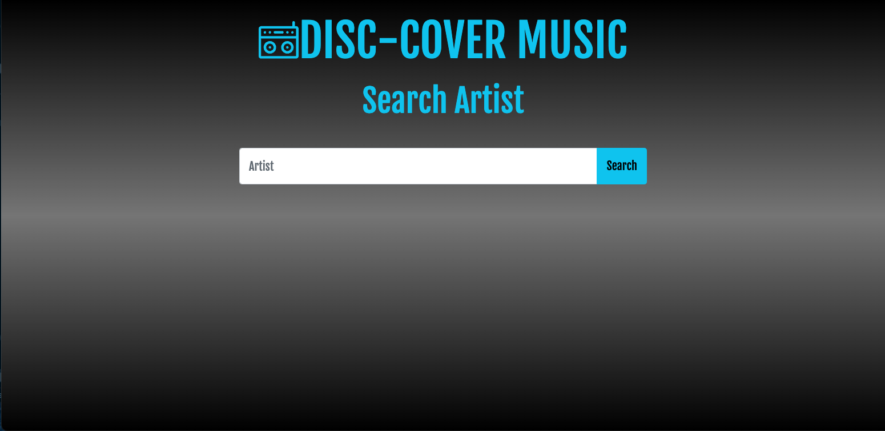
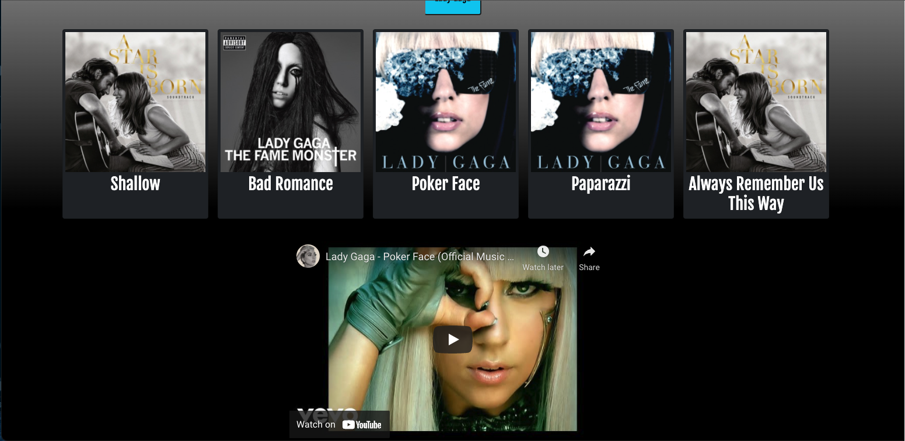

# DiscCover Music

## Description
An application that allows users to type in a musical artist and
discover music videos.

## Table of Contents
* [Technologies Used](#technologies)
* [Screenshots](#screenshots)
* [Links](#links)
* [License](#license)
* [Contributors](#contributors)

## Technologies Used
* HTML
* CSS
* Bootstrap
* Google Fonts
* JavaScript
* jQuery
* Shazam API
* YouTube API

## Screenshots

## Links
[Deployed Live](https://samanthajrexroat.github.io/DiscCover/)  
[GitHub Repository](https://github.com/samanthajrexroat/DiscCover.git)
[Pages Presentation](https://docs.google.com/presentation/d/1FOBTQ1ZcLnq3jsC9K9ltrJ7KiRGoNhmKUsfT3JjSF8I/edit?usp=sharing)

## License
MIT

## Contributors
[Joseph Dugan](https://github.com/dugan-jo) 
[Matthew Todor](https://github.com/Ccatalyst) 
[Samantha Rexroat](https://github.com/samanthajrexroat) 
[Amit Singhal](https://github.com/Asinghal81) 
[Joel Vazquez](https://github.com/Lumin-El)

